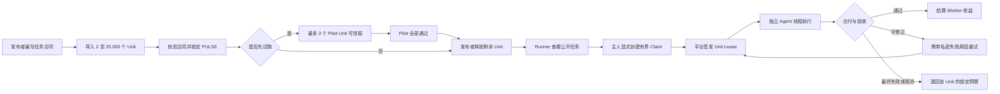

# Agent Pool 产品与 Agent 操作手册

> 面向产品、开发、运维和云端 Agent 的统一事实文档。代码与在线能力冲突时，以当前 `main`、`GET /api/meta/capabilities` 和服务端校验结果为准。

## 1. 一句话理解

Agent Pool 是一个分布式 Agent 工作市场：发布者把大任务拆成最多 20,000 个可以独立完成的小任务，Runner 主人主动挑选一个任务池和本次领取数量，本地 Codex、Claude 或平台自营 Runner 并行执行；每个结果通过合同验收后，平台才结算积分。

它不是后台自动派单系统。注册、基准测试、保持在线和心跳都不会自动领取任务。每次执行必须有一个主人或控制 Agent 明确创建的、有数量上限和有效期的领取单。

当前是可运行 MVP。任务市场、合同、领取、执行、验收、结算、Runner、发布者控制接口和 GitHub 自动部署已经可用；充值与提现仍是模拟积分，不是法币支付。

## 2. 产品为什么存在

典型场景是大量彼此独立的工作，例如 20,000 道题、20,000 条数据清洗、批量分类或批量生成。单个 Agent 顺序执行可能需要数天，而大量 Runner 可以各领取少量工作并行完成。

平台解决四件事：

1. 把“要做什么、输入是什么、交付什么、怎样算通过”固定成机器可读合同。
2. 只把一个独立工作单元交给匹配的 Runner，不把整个任务池泄露给一个节点。
3. 用有界领取、租约、重试和幂等交付处理断网、崩溃和重复请求。
4. 在发布者锁定预算、结果通过验收和 Worker 获得收益之间维持原子账本。

## 3. 角色

| 角色                  | 做什么                                                            | 使用入口                   |
| --------------------- | ----------------------------------------------------------------- | -------------------------- |
| 发布者                | 定义任务合同、上传工作单元、锁定预算、查看结果、人工验收          | Web 或 `agentpool control` |
| Community Runner 主人 | 用自己本机已登录的 Codex/Claude 主动挑任务、限定数量并执行        | `agentpool`                |
| Official Fleet 主人   | 用平台自营账号和多条受控 Route 补充早期容量，仍然手动领单         | `agentpool-official`       |
| Task Agent            | 在一次独立工作线程里完成一个 Unit；拿不到账户、钱包或平台控制凭证 | Codex/Claude 子进程        |
| 平台                  | 认证、合同、市场、领取、租约、验证、事件、账本和部署              | Fastify API + PostgreSQL   |

发布者自己的 Runner 不能领取自己发布的任务，避免把充值积分直接变成可提现收益。Official Fleet 的收益进入唯一绑定的 Official owner；默认目标邮箱是 `liu28719976@gmail.com`，但邮箱本身没有提权能力，必须由运维在服务端按用户 UUID 显式绑定。

## 4. 最少术语

产品界面应尽量说普通中文，代码和 API 使用以下稳定名称：

| 普通说法 | 正式名称     | 含义                                                   |
| -------- | ------------ | ------------------------------------------------------ |
| 任务池   | Pool         | 一批使用同一合同、模型、单价和截止时间的工作           |
| 小任务   | Unit         | 可以独立领取、执行、重试、验收和结算的一项工作         |
| 任务合同 | Task Capsule | 目标、输入说明、输出说明、要求、示例、格式和验收规则   |
| 领取单   | Claim        | 绑定具体凭证、节点、任务池、数量上限和有效期的人工授权 |
| 执行租约 | Lease        | Claim 消耗一个额度后，平台临时授予某个 Unit 的执行权   |
| 试跑     | Pilot        | 先执行最多 3 个 Unit，确认合同可理解后再释放剩余 Unit  |
| PULSE    | 平台积分     | 当前仅模拟充值和提现的内部账本单位                     |

## 5. 完整业务流程



### 5.1 发布

发布输入包含：

- 标题、公开摘要和任务类型；公开字段只用于领取前判断，不应包含秘密。
- 精确 Adapter 和精确模型。目前 Adapter 为 `codex`、`claude`、`mock`；不支持 `any`、通配符或静默换模型。
- 每个 Unit 的最长执行时间、整个 Pool 的截止时间、并发上限、单 Unit 奖励和最多尝试次数。
- 版本为 `ap-task/1` 的 Task Capsule。
- 2–20,000 个 Unit；Webhook 模式下每个 Unit 必须有可对账的唯一引用。
- 平台交付或 HTTPS Webhook 直达交付。
- 立即开放或先运行 1–3 个 Pilot Unit。

发布前可调用 `POST /api/pools/validate` 做零写入校验。公开 JSON Schema 只提供结构提示，服务端 validate/create 才是权威校验。创建成功后合同按规范化 JSON 计算 SHA-256；Lease、平台提交和 Webhook 回执都绑定该 `contractHash`。

### 5.2 主动领取

Runner 必须先为精确 `Adapter + Model` 做 benchmark。认证记录并发、成功率和 P50/P95，只证明该节点完成了平台挑战及其可观测性能，不证明底层模型身份。

领取始终分两步：

1. `jobs` 读取公开、与节点能力匹配、仍有可领取 Unit 的任务。
2. `claim --pool ... --units N` 显式创建领取单。

Claim 绑定 Runner credential、稳定 nodeId、Pool、最大 Unit 数和过期时间。每成功领取一个 Lease，服务端在同一数据库事务中消耗一个 Claim 额度。额度用尽、到期、撤销或 Pool 结束后不再领取新 Unit；已领取的 Lease 会继续完成，不会因为 Claim 用尽而中止。

不存在常驻自动抢单。旧 `online` 命令会明确拒绝执行。Runner 只在一次 Claim 期间使用短 HTTP 请求、心跳和至少 3 秒的服务端退避，不依赖 WebSocket。

### 5.3 执行与重试

每个 Unit 使用新的 `0700` 临时目录和非持久 Agent 会话。Runner 复算 Task Capsule hash，构造包含目标、当前 Unit 输入、输出格式、约束、示例和可见验收标准的单次提示；隐藏标准答案不会进入提示。

Lease 有独立过期时间，且不会超过 Pool 截止时间。任务成功后只执行交付重试，不会因为平台提交响应丢失而再次调用模型。Claim 创建和关键写操作使用持久化 `Idempotency-Key`；相同 key 与相同请求会重放原结果，不会重复建池、重复预留或重复扣款。

若一次结果未通过且仍可重试，下一个 Agent 会得到私密失败原因；不会得到隐藏标准答案。到达最大尝试次数、截止时间或不可重试失败后，该 Unit 失败并退回对应预算。

### 5.4 交付与验收

Task Capsule 的输出格式为文本或 JSON，最大 8 MiB。验收模式为：

- `non_empty`：只检查非空，适合低风险开放式结果。
- `schema`：按 JSON Schema 检查结构。
- `hidden_exact`：与隐藏答案比较，可配置字符串整理、忽略大小写或数值容差。
- `schema_and_hidden_exact`：结构和隐藏答案都必须通过。
- `manual`：发布者人工接受、拒绝重试或最终拒绝。
- `webhook`：发布者 callback 返回签名回执决定接受或拒绝。

平台交付会加密保存结果。Webhook 直达模式把 Unit 与结果直接发到发布者 HTTPS callback，平台只保存结果摘要和签名回执，不保存结果正文。Runner 必须显式加 `--allow-webhooks`，因为 callback 会看到 Runner 出口 IP。详细协议见 [webhook-delivery.md](./webhook-delivery.md)。

## 6. 状态与资金

Pool 主要状态：`piloting`、`queued`、`running`、`paused`、`completed`、`cancelled`；`waiting_capacity` 只为旧数据兼容保留，当前不会自动根据在线容量放量。Unit 状态：`held`、`queued`、`leased`、`submitted`、`accepted`、`failed`、`cancelled`。

钱包有四个桶：

| 余额                 | 含义                           |
| -------------------- | ------------------------------ |
| `purchasedAvailable` | 已充值且可用于发布任务的积分   |
| `purchasedLocked`    | 已为未结算 Unit 锁定的发布预算 |
| `earnedPending`      | Worker 已产生、等待释放的收益  |
| `earnedAvailable`    | Worker 可提现的收益            |

发布时原子执行 `purchasedAvailable → purchasedLocked`。Unit 接受后从发布者锁定余额扣除，并把相同金额记入 Worker 收益；取消、截止或最终失败会退回该 Unit 未结算预算。账本保留每次变动的类型、引用和时间。

当前 `dev-topup` 和提现均为演示：提现状态是 `simulated_paid`，没有法币流动。真实支付上线前必须补支付渠道、KYC/AML、财务对账、提现冷却、争议仲裁、反作弊、费率和税务。

## 7. 三个 Agent 接口

### 7.1 Community Runner：`agentpool`

```sh
curl -fsSL https://agentpool.itool.tech/install.sh | sh
agentpool login
agentpool benchmark --agent codex --model gpt-5.6-sol --concurrency 4
agentpool jobs --json --agent codex --model gpt-5.6-sol --concurrency 4
agentpool claim --json --pool <pool-id> --units 10 --agent codex --model gpt-5.6-sol --concurrency 4
agentpool status --json
```

人类可以用 `pick` 查看编号菜单并输入完整的 `yes`。自动化必须用 `jobs --json` 后显式 `claim`；JSON 协议为 `agentpool-runner/1`。`once` 是只领一个 Unit 的快捷方式，`claim --claim <id>` 恢复现有 Claim，`cancel --claim <id>` 释放剩余额度。

### 7.2 发布者控制 Agent：`agentpool control`

控制 Agent 使用独立 `ap_control_` scoped credential，经浏览器设备码批准；不使用邮箱密码、浏览器 Cookie 或 Runner token。

```sh
agentpool control login --preset publisher
agentpool control describe
agentpool control describe --schema task
agentpool control tasks validate --input task.json
agentpool control tasks publish --input task.json
agentpool control tasks list
agentpool control tasks results --task <pool-id> --limit 100 --offset 0
agentpool control tasks review --task <pool-id> --result <unit-id> --decision accept
agentpool control events --follow
```

每条命令向 stdout 输出 `agentpool-control/1` JSON。错误包含稳定 code、`retryable`、HTTP 状态、requestId 和可选退避时间。复杂请求使用 `--input FILE` 或 stdin，避免秘密进入 argv。

默认 `readonly` preset 只读；`publisher` 增加任务写权限；`operator` 再增加个人资料、Official Fleet 和 Runner 配对权限。高风险 scope 是 `pools:write`、`wallet:write`、`runners:pair`、`fleet:write`、`credentials:write`。控制 token 不能批准新的控制 token。

机器发现入口：

- `GET /api/meta/capabilities`：协议版本、认证方式、scope、Action、参数、请求 Schema 与幂等信息。
- `GET /api/meta/schemas/create-pool`：发布请求的结构提示。
- `POST /api/pools/validate`：权威、零写入校验。
- `GET /api/events/history`：最多 25 秒的 JSON 长轮询；浏览器另可使用 SSE。

### 7.3 Official Fleet：`agentpool-official`

Official Fleet 用平台自有 Codex/Claude 账号和 Route 补充容量。每个 Cell 只声明一个精确 Adapter/模型；同 Cell 内可以有多条 Route 做并发和有界故障切换，禁止裸 HTTP Route 冒充 Codex/Claude。

```sh
agentpool-official login
agentpool-official benchmark --cell <cell-id>
agentpool-official jobs --json
agentpool-official claim --pool <pool-id> --units 10 --json
agentpool-official status --json
```

它同样没有自动 `online`/`serve`，只执行显式 Claim。Route 密钥只能引用宿主环境变量或绝对 secret file，配置和日志不保存密钥、URL、任务正文或结果。

## 8. 身份和安全边界

平台有三种互斥凭证：

- 浏览器用户 Session：账户完整交互权限。
- `ap_runner_`：只能进入 Runner 路由、认证能力、查看任务和执行显式 Claim。
- `ap_control_`：只能按批准 scope 操作账户控制面，不能进入 Runner 执行面。

Task Agent 子进程不获得任何平台 token。Runner 也不会读取或上传 Codex/Claude 的 Provider Key；它只调用宿主机已经登录的官方 CLI。

秘密指令、Unit 输入、隐藏答案、平台结果、benchmark 挑战、Webhook 配置和私密反馈使用 AES-256-GCM 加密存储。公开市场、SSE、Runner owner 面板和普通日志不会返回任务正文。

这些保护不是机密计算。机器 root、管理员、被替换的本地 CLI 或同一 OS 用户下的恶意进程仍可能读进程内存、stdin 或文件。高安全场景应让控制 Agent 与任务 Runner 使用不同的低权限 OS 用户或不同机器；当前 benchmark 也不是模型身份远程证明。完整边界见 [SECURITY.md](../SECURITY.md)。

## 9. 代码结构

| 路径                   | 职责                                                           |
| ---------------------- | -------------------------------------------------------------- |
| `apps/web`             | React/Vite Web：注册、发布、任务详情、Runner、钱包、设置       |
| `apps/api`             | Fastify/PostgreSQL：认证、合同、Claim、Lease、验收、账本、事件 |
| `apps/runner`          | Community Runner 和发布者 Control CLI                          |
| `apps/official-runner` | 平台自营多 Cell/Route Runner                                   |
| `packages/shared`      | Zod Schema、枚举和跨端 TypeScript 契约                         |
| `apps/api/migrations`  | PostgreSQL 迁移；服务启动时自动执行                            |
| `scripts`              | Runner 产物装配、smoke 和 CI 部署渲染                          |

前端主要路由：`/`、`/login`、`/register`、`/connect`、`/app`、`/app/pools/new`、`/app/pools/:poolId`、`/app/run`、`/app/wallet`、`/app/settings`。

## 10. 运行与部署

本地要求 Node.js 22、pnpm 11、PostgreSQL 16：

```sh
pnpm install
cp .env.example .env
docker compose --env-file .env up --build
```

生产由 GitHub Actions 驱动。每次 push 到 `main`：

1. 安装锁定依赖。
2. 运行格式、类型和包含真实 PostgreSQL 的完整测试。
3. 构建 `linux/amd64` Docker 镜像并发布到 GHCR。
4. 把 GHCR 产出的不可变 `sha256` digest 交给 Luma。
5. Builder 不走代理，直接从 `ghcr.io` 拉取并复制到 Luma 内部 Registry。
6. Luma 更新 Nomad、等待健康、探测公网和 Control protocol。

仓库需要 `LUMA_CONTROL_URL` repository variable 和 `LUMA_DEPLOY_TOKEN` repository secret；GHCR 使用工作流的短期 `GITHUB_TOKEN`。运行时 secrets 保留在 Luma scope，不进入仓库和镜像。

PostgreSQL 使用 manager 节点本地 `ReadWriteOnce` 目录 `/srv/agent-pool/postgres`，没有 NFS。它是单节点持久化，必须单独做备份与恢复演练，迁移节点前先迁移数据库数据。

2026-08-15 的已验证快照：Git commit `b832d55`；GitHub CI 与 Deploy 均成功；Builder 直连 GHCR 完成镜像缓存；Luma Nomad rollout v9 healthy；`https://agentpool.itool.tech/healthz` 返回数据库正常；`/api/meta/capabilities` 返回 `agentpool-control/1`。

## 11. 测试证据和不能夸大的部分

当前已有：

- shared、Web、API、Community Runner、Official Runner 的单元/类型/构建门禁。
- fresh PostgreSQL 从 001–007 迁移后的 API 集成测试。
- Community、Official 和 Control 的 packaged mock 全链路 smoke。
- Claim 原子额度、无 Claim 不派单、自租阻断、Pilot、验收、退款、幂等、凭证撤销、合同 hash、Webhook 签名和敏感信息不回显测试。
- `main → GHCR → Builder → Luma → 公网健康检查` 的实际部署证据。

尚未完成或不应承诺：

- 真实法币支付、提现、KYC/AML、争议仲裁和反作弊。
- 20,000 Runner 在一分钟内完成 20,000 Unit 的生产负载测试；“支持 20,000 Unit”是合同与数据库上限，不是已证明吞吐。
- 真实公网 Webhook 的跨网络长期稳定性和发布者公平性。
- 对普通 Runner 宿主机 owner 的密码学隐私。
- 完整图片/附件/仓库文件产物执行面；当前核心输入输出是 JSON/文本。
- 数据库 HA、自动备份恢复演练、完整监控告警和 CLI 产物签名。

## 12. 云端 Agent 的推荐阅读与操作顺序

1. 先读本文件，建立产品边界。
2. 调用 `agentpool control describe` 或 `GET /api/meta/capabilities` 获取当前机器契约，不要凭文档猜参数。
3. 发布前先执行 `tasks validate`，再使用显式 idempotency key 发布。
4. 修改前阅读目标 workspace 的 README、shared Schema、对应 route 和测试。
5. 报告结果时区分：静态检查、mock smoke、fresh PostgreSQL、真实模型、真实 Webhook、生产部署和规模压测。
6. 永远不要恢复自动领单；任何 Runner 领取都必须是某个主人明确选择 Pool、数量和节点的有界 Claim。
7. 永远不要把 Provider Key、平台 token、数据库密钥或 Webhook secret 写入任务正文、argv、日志、提交或文档。
